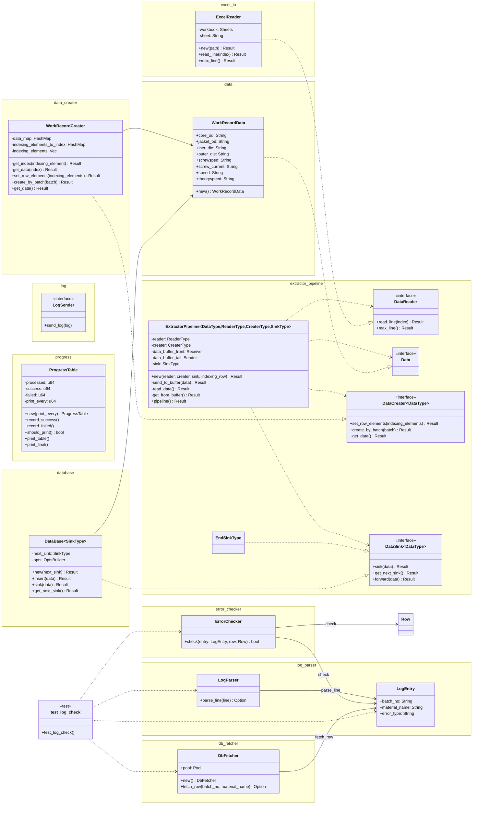

```mermaid

classDiagram
direction LR

namespace data {
  class WorkRecordData {
    +core_od: String
    +jacket_od: String
    +iner_die: String
    +outer_die: String
    +screwsped: String
    +screw_current: String
    +speed: String
    +theoryspeed: String
    +new() WorkRecordData
  }
}

namespace extractor_pipeline {
  class DataReader {
    <<interface>>
    +read_line(index) Result
    +max_line() Result
  }

  class Data {
    <<interface>>
  }

  class DataCreater~DataType~ {
    <<interface>>
    +set_row_elements(indexing_elements) Result
    +create_by_batch(batch) Result
    +get_data() Result
  }

  class DataSink~DataType~ {
    <<interface>>
    +sink(data) Result
    +get_next_sink() Result
    +forward(data) Result
  }

  class EndSinkType

  class ExtractorPipeline~DataType,ReaderType,CreaterType,SinkType~ {
    -reader: ReaderType
    -creater: CreaterType
    -data_buffer_front: Receiver
    -data_buffer_tail: Sender
    -sink: SinkType
    +new(reader, creater, sink, indexing_row) Result
    -send_to_buffer(data) Result
    -read_data() Result
    -get_from_buffer() Result
    +pipeline() Result
  }
}

namespace excel_io {
  class ExcelReader {
    -workbook: Sheets
    -sheet: String
    +new(path) Result
    +read_line(index) Result
    +max_line() Result
  }
}

namespace data_creater {
  class WorkRecordCreater {
    -data_map: HashMap
    -indexing_elements_to_index: HashMap
    -indexing_elements: Vec
    -get_index(indexing_element) Result
    -get_data(index) Result
    +set_row_elements(indexing_elements) Result
    +create_by_batch(batch) Result
    +get_data() Result
  }
}

namespace database {
  class DataBase~SinkType~ {
    -next_sink: SinkType
    -opts: OptsBuilder
    +new(next_sink) Result
    +insert(data) Result
    +sink(data) Result
    +get_next_sink() Result
  }
}

namespace log {
  class LogSender {
    <<interface>>
    +send_log(log)
  }
}

WorkRecordData ..|> Data
ExcelReader ..|> DataReader
WorkRecordCreater ..|> DataCreater~WorkRecordData~
DataBase ..|> DataSink~WorkRecordData~
EndSinkType ..|> DataSink~DataType~

ExtractorPipeline ..> Data
ExtractorPipeline ..> DataReader
ExtractorPipeline ..> DataCreater~DataType~
ExtractorPipeline ..> DataSink~DataType~
DataBase --> WorkRecordData
WorkRecordCreater --> WorkRecordData
namespace db_fetcher {
  class DbFetcher {
    +pool: Pool
    +new() DbFetcher
    +fetch_row(batch_no, material_name) Option<Row>
  }
}

namespace error_checker {
  class ErrorChecker {
    +check(entry: LogEntry, row: Row) bool
  }
}

namespace log_parser {
  class LogEntry {
    +batch_no: String
    +material_name: String
    +error_type: String
  }
  class LogParser {
    +parse_line(line) Option<LogEntry>
  }
}

namespace progress {
  class ProgressTable {
    -processed: u64
    -success: u64
    -failed: u64
    -print_every: u64
    +new(print_every) ProgressTable
    +record_success()
    +record_failed()
    +should_print() bool
    +print_table()
    +print_final()
  }
}

class test_log_check {
  <<test>>
  +test_log_check()
}

test_log_check ..> DbFetcher
test_log_check ..> ErrorChecker
test_log_check ..> LogParser
test_log_check ..> LogEntry
DbFetcher --> LogEntry : fetch_row
ErrorChecker --> LogEntry : check
ErrorChecker --> Row : check
LogParser --> LogEntry : parse_line
```
